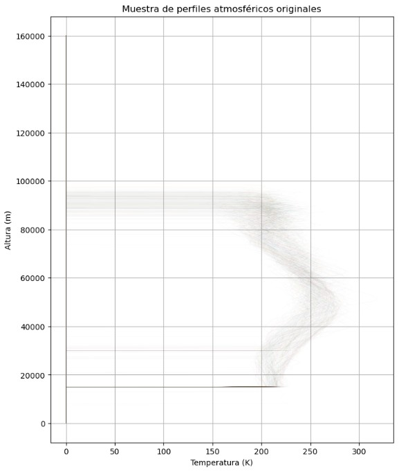
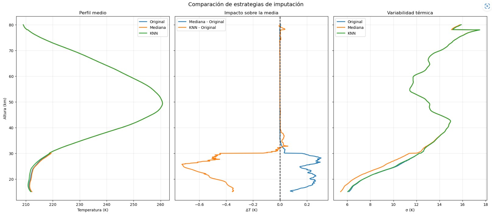
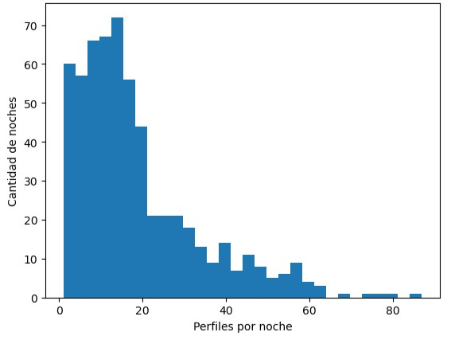
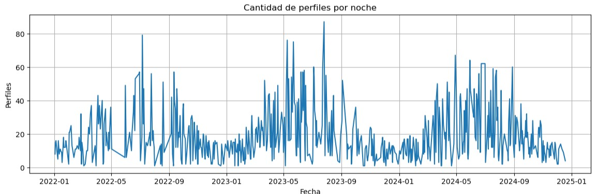
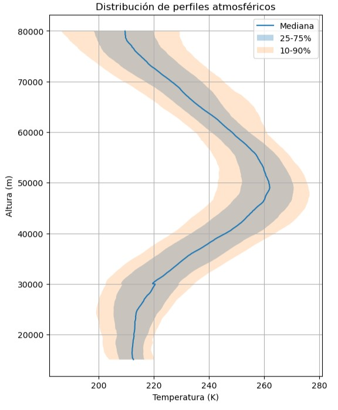
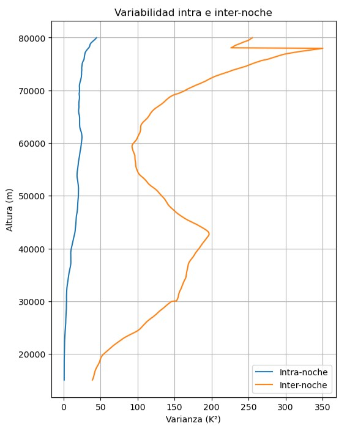
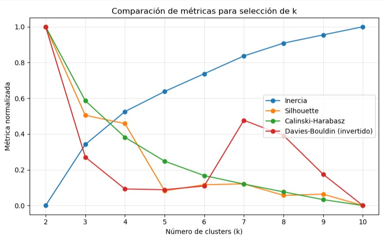

# Entrega 3: Proyecto Southwave - Presentación del Modelo y Análisis de Resultados

## Clasificación de noches atmosféricas a partir de perfiles de temperatura obtenidos con LIDAR CORAL

---

## 1. Resumen ejecutivo

Este trabajo tiene como objetivo clasificar noches de observación atmosférica a partir de perfiles verticales de temperatura obtenidos mediante el sistema LIDAR CORAL, instalado en la Estación Astronómica Río Grande.

El problema original consistía en identificar distintos estados de la atmósfera, tales como noches tranquilas, noches con ondas de montaña, estratopausa elevada, doble estratopausa o noches fuertemente perturbadas. Sin embargo, el conjunto de datos disponible no contaba con etiquetas previas para entrenar un modelo supervisado. Por este motivo, el proyecto se abordó como un problema de aprendizaje no supervisado.

La estrategia seguida fue clasificar primero perfiles individuales de temperatura mediante K-Means y luego resumir cada noche a partir de la composición de clusters presentes durante esa noche. De esta manera, el modelo no solo agrupa perfiles aislados, sino que permite avanzar hacia el objetivo principal del proyecto: caracterizar noches completas según su estado atmosférico predominante o según su grado de mezcla interna.

El modelo final identificado en esta etapa utiliza cuatro clusters principales. Estos clusters muestran una estructura estacional marcada: un cluster domina claramente en verano, otro aparece principalmente en estaciones de transición, y dos clusters se asocian mayormente con condiciones invernales. Esta organización sugiere que el modelo logró capturar patrones térmicos relevantes en la atmósfera, aunque todavía no permite asignar de manera automática etiquetas físicas definitivas como “ondas de montaña” o “doble estratopausa”.

---

## 2. Contexto y origen del proyecto

El proyecto surge a partir del trabajo con observaciones atmosféricas realizadas mediante el sistema CORAL (*Compact Rayleigh Autonomous Lidar*), ubicado en la Estación Astronómica Río Grande. Este instrumento permite obtener perfiles de temperatura atmosférica a partir de mediciones nocturnas de retrodispersión.

El objetivo planteado inicialmente fue clasificar cada noche de observación de acuerdo con el estado de la atmósfera. En la propuesta original se mencionaban distintos tipos de noches o situaciones atmosféricas de interés:

- noche tranquila o atmósfera estándar;
- fuertes ondas de montaña;
- estratopausa elevada;
- fuertes perturbaciones en la mesosfera superior;
- doble estratopausa con ondas de montaña en la estratósfera;
- estructuras complejas o “sopa de ondas”.

A partir del intercambio con el especialista, esa clasificación fue refinada hacia un conjunto de estados físicos más acotado:

- noche tranquila;
- ondas de montaña (en la estratósfera, en la mesósfera o en ambas regiones);
- estratopausa elevada;
- doble estratopausa.

Esta distinción es importante porque el modelo desarrollado no recibió esas categorías como etiquetas. En consecuencia, los clusters obtenidos no deben interpretarse automáticamente como esos estados físicos, sino como agrupamientos térmicos que luego deben ser contrastados con la interpretación atmosférica.

---

## 3. Origen de los datos

Los archivos originales contenían perfiles de temperatura en función de la altura y del tiempo de observación. Cada archivo representaba una noche de medición y podía contener varios perfiles registrados a lo largo de esa misma noche. Contenían datos noches comprendidas entre 2017 y 2025.

Las variables principales consideradas fueron:

- archivo de origen;
- fecha de observación;
- tiempo de medición;
- altura;
- temperatura.

La estructura inicial provenía de numerosos archivos CSV, posteriormente consolidados en un dataset maestro. En una primera consolidación se trabajó con 1702 archivos originales, que fueron organizados en una matriz general con información de fecha, tiempo y temperaturas por altura.

Durante el proceso de construcción del dataset se identificaron perfiles completamente nulos, perfiles válidos y zonas verticales con distinto grado de confiabilidad física. A partir de esos resultados y del criterio del especialista, se decidió trabajar con el rango vertical comprendido entre 15.000 y 80.000 metros.


---

## 4. Trazabilidad del proceso realizado

El proyecto fue avanzando por etapas sucesivas. Cada etapa permitió tomar decisiones metodológicas que impactaron en el dataset final y en el modelo utilizado.

### 4.1 Consolidación inicial

En la primera etapa se consolidaron los archivos originales en una única estructura de datos. La matriz inicial quedó formada por:

- 40.747 filas;
- 1.603 columnas;
- alturas desde aproximadamente 68 m hasta 159.968 m;
- variables de identificación como archivo, fecha y tiempo.

En esta etapa se identificaron:

- 15.055 perfiles completamente nulos;
- 25.692 perfiles válidos.

Los perfiles completamente nulos fueron descartados, ya que no representaban observaciones atmosféricas utilizables.

### 4.2 Selección temporal y vertical

Luego se aplicaron dos criterios principales:

1. conservar observaciones correspondientes a los años 2022, 2023 y 2024;
2. recortar el rango vertical entre 15.000 y 80.000 metros.

El recorte temporal estaba previsto en las indicaciones iniciales del proyecto.
El recorte vertical fue una decisión importante. Habían muy pocos perfiles con alturas inferiores a 15 km podían estar afectadas por contaminación o condiciones no representativas para el objetivo del análisis, mientras que las alturas superiores a 80 km comenzaban a perder consistencia en algunos perfiles.

Ambas decisiones fueron validadas por el especialista en el proyecto.

Los valores 0 remanentes fueron convertidos a valores faltantes, ya que efectivamente eran el resultado de filtrados propios de los sistemas de procesamiento de los datos originales.

Luego de este proceso, se obtuvo el archivo:

```text
perfiles_limpios_2022_2024_15000_80000.csv
```

Este dataset quedó formado de la siguiente manera:

- 11.041 perfiles;
- 653 columnas;
- 3 columnas descriptivas: `archivo`, `fecha`, `time`;
- 650 columnas de temperatura correspondientes a distintos niveles de altura entre 15 y 80 km.



### 4.3 Tratamiento de valores faltantes

Luego del recorte vertical y temporal se identificaron perfiles con valores faltantes. El análisis mostró:

- 8.541 perfiles completos, sin valores faltantes;
- 2.500 perfiles con al menos un valor faltante;
- aproximadamente 22,64 % de los perfiles con algún valor faltante;
- un máximo de 324 valores faltantes en un mismo perfil.

Para evaluar el efecto del tratamiento de valores faltantes se generaron tres datasets:

| Dataset | Criterio | Propósito |
|---|---|---|
| Dataset A | Solo perfiles completos | Base de control sin imputación |
| Dataset B | Imputación por mediana vertical | Estrategia simple y robusta |
| Dataset C | Imputación mediante KNN | Estrategia basada en similitud entre perfiles |

La comparación entre estrategias mostró que la imputación no alteraba de manera importante la estructura general de los perfiles. En particular, se observaron diferencias máximas pequeñas en los perfiles medios y en la variabilidad por altura:

| Comparación | Diferencia máxima observada |
|---|---:|
| Media - Mediana | 0,306 K |
| Media - KNN | 0,729 K |
| Desvío - Mediana | 1,217 K |
| Desvío - KNN | 0,143 K |

A partir de esta comparación se decidió utilizar el Dataset C como base principal del modelo, ya que permitía conservar mayor cantidad de información y mantenía adecuadamente la estructura térmica de los perfiles. El Dataset A se conservó como referencia de control.



---

## 5. Análisis exploratorio de datos

El análisis exploratorio permitió comprender la estructura del dataset antes de aplicar el modelo. Se analizaron la cantidad de perfiles por noche, la distribución temporal de las observaciones, la variabilidad de los perfiles, la presencia de valores faltantes y la estructura térmica por altura.

### 5.1 Cantidad de perfiles por noche

El dataset final incluyó 597 noches válidas. La cantidad de perfiles por noche resultó variable:

| Estadístico | Perfiles por noche |
|---|---:|
| Cantidad de noches | 597 |
| Promedio | 18,49 |
| Desvío estándar | 14,92 |
| Mínimo | 1 |
| Primer cuartil | 8 |
| Mediana | 15 |
| Tercer cuartil | 24 |
| Máximo | 87 |

Esta variabilidad es relevante porque no todas las noches tienen la misma representatividad. Algunas noches cuentan con pocos perfiles, mientras que otras permiten observar mejor la evolución temporal de la atmósfera durante la noche.

Por este motivo, la unidad final de análisis no puede ser solamente el perfil individual. Es necesario resumir cada noche en función de la cantidad y proporción de perfiles asignados a cada cluster.



### 5.2 Distribución mensual de perfiles

También se analizó la cantidad promedio de perfiles por mes. Los valores observados fueron aproximadamente:

| Mes | Promedio de perfiles por noche |
|---|---:|
| Enero | 10,86 |
| Febrero | 12,75 |
| Marzo | 18,87 |
| Abril | 23,38 |
| Mayo | 27,14 |
| Junio | 30,74 |
| Julio | 27,28 |
| Agosto | 18,15 |
| Septiembre | 21,02 |
| Octubre | 15,09 |
| Noviembre | 10,87 |
| Diciembre | 8,12 |

Se observa una mayor cantidad de perfiles por noche durante los meses de otoño e invierno, y una menor cantidad durante los meses de verano. Esto es relevante y coincide con el hecho que las noches en Rio Grande son mucho más largas en invierno que en verano. Esto debía tenerse en cuenta al interpretar los resultados, ya que la disponibilidad de datos no es uniforme a lo largo del año.




### 5.3 Estructura térmica de los perfiles

El análisis de perfiles medianos y sus cuartiles mostró diferencias en la estructura vertical de temperatura. Estas diferencias justificaron la aplicación de técnicas de clustering, ya que los perfiles no parecían responder a una única forma térmica común.



También se observó que las diferencias entre noches eran relevantes para el problema, reforzando la decisión de avanzar hacia una clasificación nocturna y no solamente de perfiles individuales.




### 5.4 Conclusiones del análisis exploratorio

El análisis exploratorio permitió establecer las siguientes conclusiones:

1. Los perfiles completamente nulos debían eliminarse.
2. El rango vertical más adecuado para el análisis era 15–80 km.
3. La cantidad de perfiles por noche era variable.
4. Los valores faltantes podían tratarse mediante imputación sin alterar de manera crítica la estructura general del dataset.
5. El Dataset C, con imputación KNN, resultó adecuado como dataset principal.
6. La clasificación final debía realizarse a escala nocturna.
7. Los perfiles presentaban variaciones suficientes como para aplicar aprendizaje no supervisado.

---

## 6. Formulación del modelo

Dado que el dataset no contaba con etiquetas previas, el problema fue abordado mediante aprendizaje no supervisado.

El algoritmo seleccionado fue K-Means. Este algoritmo agrupa observaciones en función de su similitud, buscando que los elementos dentro de un mismo cluster sean parecidos entre sí y que los distintos clusters queden lo más separados posible.

En este caso, cada observación corresponde a un perfil vertical de temperatura. El modelo agrupa perfiles térmicos similares, sin conocer previamente si corresponden a una noche tranquila, una noche con ondas, una estratopausa elevada u otro estado físico.

La secuencia general del modelo fue:

1. selección de perfiles válidos;
2. recorte vertical 15–80 km;
3. tratamiento de valores faltantes;
4. selección del Dataset C como dataset principal;
5. aplicación de K-Means sobre perfiles individuales;
6. evaluación de distintos valores de `k`;
7. selección de `k = 4`;
8. asignación de cluster a cada perfil;
9. agregación de resultados por noche;
10. interpretación física y estacional de los clusters.

Durante el proyecto se consideró la posibilidad de utilizar PCA como técnica de reducción dimensional. Sin embargo, para esta etapa se priorizó el análisis con K-Means sobre los perfiles preprocesados, conservando la lectura física directa de las temperaturas por altura. Esto permite interpretar mejor los centroides y los perfiles representativos de cada cluster. Fue posible no escalar los valores ya que todos los valores son temperaturas, las alturas correspondian a las columnas de los datos, no a datos en sí mismos.

---

## 7. Evaluación del número de clusters

Se evaluaron distintos valores de `k`, entre 2 y 10. Para comparar los resultados se utilizaron métricas internas de clustering:

- inercia;
- silhouette score;
- Calinski-Harabasz;
- Davies-Bouldin.

Algunos resultados relevantes fueron:

| k | Inercia | Silhouette | Calinski-Harabasz | Davies-Bouldin |
|---:|---:|---:|---:|---:|
| 2 | 7,319e8 | 0,3330 | 6551,84 | 1,1864 |
| 3 | 6,300e8 | 0,2486 | 4698,96 | 1,6235 |
| 4 | 5,750e8 | 0,2407 | 3783,04 | 1,7304 |
| 5 | 5,415e8 | 0,1767 | 3183,68 | 1,7328 |

Si observamos la inercia, `k = 4` muestra el punto de inflexión a partir del cual la relación se vuelve más lineal. Si se observa el silhouette score, `k = 2` podría parecer una solución posible, pero desde el punto de vista interpretativo, resulta muy simple;  `k = 3` y `k = 4` podrían brindar buenos resultados; `k = 5` no parecería ser una buena solución al ver como cae el valor. Hay que recordar que estamos buscando confirmar o negar la posibilidad que haya entre 4 y 6 clusters.

La solución con `k = 4` ofreció un mejor equilibrio entre reducción de inercia, separación razonable de grupos e interpretación física. 

Por este motivo, se adoptó `k = 4` como primera solución principal para la entrega.



Sin embargo se realizó la prueba para `k = 2` a `k = 7` y esto confirmó lo que a priori parecía la mejor opción.


---

## 8. Resultados del modelo

El modelo K-Means con `k = 4` asignó cada perfil a uno de cuatro clusters: C0, C1, C2 y C3.

La distribución general fue:

| Cluster | Cantidad de perfiles | Porcentaje |
|---|---:|---:|
| C0 | 1.752 | 15,87 % |
| C1 | 2.741 | 24,83 % |
| C2 | 3.776 | 34,20 % |
| C3 | 2.772 | 25,11 % |

Los cuatro clusters tienen una presencia relevante en el dataset. Ninguno aparece como un grupo marginal, lo cual refuerza la utilidad de la solución seleccionada.

> **Gráfico sugerido:** barras con cantidad o porcentaje de perfiles por cluster.

### 8.1 Distribución estacional de los clusters

El análisis por estación mostró una estructura muy marcada:

| Estación | C0 | C1 | C2 | C3 |
|---|---:|---:|---:|---:|
| Verano | 0,0 % | 0,1 % | 99,2 % | 0,7 % |
| Otoño | 4,7 % | 34,0 % | 21,1 % | 40,2 % |
| Invierno | 38,0 % | 18,7 % | 5,6 % | 37,7 % |
| Primavera | 10,9 % | 36,9 % | 50,1 % | 2,2 % |

El resultado más claro es la marcada asociación entre C2 y el verano. En esa estación, C2 concentra prácticamente la totalidad de los perfiles. Esto sugiere que representa un régimen térmico estival muy definido.

C1 aparece principalmente en primavera y otoño, por lo que puede interpretarse como un estado de transición estacional.

C0 y C3 aparecen principalmente en invierno. El modelo, entonces, no identifica un único estado invernal, sino dos configuraciones térmicas distintas dentro de esa estación.

> **Gráfico sugerido:** distribución porcentual de clusters por estación.

### 8.2 Interpretación preliminar de los clusters

A partir de la distribución estacional y de los perfiles representativos, se propone la siguiente interpretación preliminar:

| Cluster | Comportamiento observado | Interpretación preliminar |
|---|---|---|
| C0 | Predomina en invierno junto con C3 | Estado térmico invernal 1 |
| C1 | Frecuente en primavera y otoño | Estado de transición estacional |
| C2 | Predomina casi exclusivamente en verano | Estado térmico estival |
| C3 | Predomina en invierno junto con C0 | Estado térmico invernal 2 |

Esta interpretación no debe entenderse como una clasificación física definitiva. Los clusters representan patrones térmicos dominantes. La asociación con estados físicos como ondas de montaña, estratopausa elevada o doble estratopausa requiere análisis adicional.

---

## 9. Agregación por noche

El objetivo original del proyecto era clasificar noches completas. Por eso, luego de asignar clusters a los perfiles individuales, se construyó un resumen nocturno.

Para cada noche se calcularon:

- cantidad de perfiles en C0;
- cantidad de perfiles en C1;
- cantidad de perfiles en C2;
- cantidad de perfiles en C3;
- cluster dominante;
- porcentaje del cluster dominante (`max_pct`);
- entropía nocturna;
- evolución temporal de clusters durante la noche.

El archivo generado para esta etapa fue:

```text
resumen_nocturno_clusters.csv
```

Este resumen permite pasar del nivel de perfil individual al nivel de noche completa.

Una noche con `max_pct` alto y entropía baja puede interpretarse como una noche dominada por un único estado térmico. En cambio, una noche con menor dominancia y mayor entropía puede considerarse una noche mixta o de transición.

Esta distinción es importante porque algunas categorías físicas esperadas, como una noche tranquila o una noche perturbada, podrían no depender solamente del cluster dominante, sino también de la estabilidad interna de la noche.

> **Gráfico sugerido:** ejemplos de noches muy representativas de C0, C1, C2 y C3.

> **Gráfico sugerido:** ejemplos de noches con alta entropía.

---

## 10. Evolución temporal y transiciones

Además de analizar la composición de cada noche, se estudió la evolución temporal de los clusters. Este análisis permitió observar que las transiciones no parecen ser completamente casuales.

En términos generales:

- C2 es predominante en verano y también aparece en transiciones hacia primavera y otoño;
- C1 se ubica principalmente en primavera y otoño;
- C0 y C3 aparecen como dos tipos de estados invernales;
- C2 y C3 prácticamente no presentan noches mixtas relevantes entre sí.

Esta organización temporal refuerza la idea de que los clusters no son simples agrupamientos matemáticos sin estructura, sino que capturan información relacionada con la evolución estacional de la atmósfera.

> **Gráfico sugerido:** matriz de transición entre clusters.

> **Gráfico sugerido:** grilla con evolución temporal de clusters y perfiles térmicos coloreados por cluster.

---

## 11. Contraste con los estados físicos esperados

Uno de los puntos centrales de la entrega es comparar los estados atmosféricos esperados con los estados identificados por el modelo.

La clasificación física esperada incluía:

- noche tranquila;
- ondas de montaña en la estratósfera;
- ondas de montaña en la mesósfera;
- ondas de montaña en ambas regiones;
- estratopausa elevada;
- doble estratopausa.

El modelo identificó cuatro clusters térmicos principales. Esto no significa que exista una equivalencia directa uno a uno entre clusters y estados físicos. La razón es que K-Means solo utilizó la forma de los perfiles de temperatura, sin información explícita sobre ondas, estratopausa o doble estratopausa.

Por lo tanto, la comparación debe realizarse con prudencia.

| Estado físico esperado | Qué se esperaría observar | Cómo podría aparecer en el modelo |
|---|---|---|
| Noche tranquila | Perfil estable, poca variación temporal | Cluster dominante alto, entropía baja |
| Ondas de montaña en estratósfera | Oscilaciones térmicas entre 15 y 50 km | Variabilidad o desviaciones en la parte baja-media del perfil |
| Ondas de montaña en mesósfera | Oscilaciones marcadas entre 50 y 80 km | Variabilidad en la parte superior del perfil |
| Ondas en estratósfera y mesósfera | Perturbaciones en gran parte del perfil | Alta variabilidad vertical o mezcla de clusters |
| Estratopausa elevada | Máximo térmico desplazado hacia mayor altura | Centroide con máximo a mayor altura |
| Doble estratopausa | Dos máximos térmicos relativos | Perfil bimodal o transición entre estados |
| Sopa de ondas | Perfil complejo, muy perturbado | Alta entropía, baja dominancia, muchas transiciones |

Esta comparación muestra que algunos estados físicos podrían corresponder a un cluster particular, pero otros podrían manifestarse como combinaciones de clusters o como noches con alta mezcla interna.

Por ejemplo, una noche tranquila no necesariamente debería asociarse siempre a C2 o a otro cluster específico. Podría definirse mejor como una noche con alta dominancia de un solo cluster, baja entropía y poca variación temporal.

En cambio, una noche con “sopa de ondas” podría no formar un cluster propio. Podría aparecer como una noche con varios clusters, alta entropía y transiciones frecuentes.

---

## 12. Validación cualitativa con noches de referencia

Una posible validación adicional consiste en tomar noches de referencia propuestas por el especialista o por el documento inicial y observar cómo las clasifica el modelo.

La idea sería construir una tabla como la siguiente:

| Fecha | Estado esperado | Cluster dominante | % dominante | Entropía | Interpretación |
|---|---|---:|---:|---:|---|
| A completar | Noche tranquila | A completar | A completar | A completar | A completar |
| A completar | Ondas de montaña | A completar | A completar | A completar | A completar |
| A completar | Estratopausa elevada | A completar | A completar | A completar | A completar |
| A completar | Doble estratopausa | A completar | A completar | A completar | A completar |
| A completar | Sopa de ondas | A completar | A completar | A completar | A completar |

Esta validación no reemplaza a una evaluación supervisada, porque no se dispone de una base etiquetada completa. Sin embargo, permite contrastar el comportamiento del modelo con casos conocidos o esperados.

Si una noche esperada como tranquila aparece dominada por un único cluster, con alta dominancia y baja entropía, el resultado sería coherente.

Si una noche esperada como perturbada presenta mezcla de clusters, mayor entropía o transiciones durante la noche, el modelo estaría capturando parte de esa complejidad.

Esta etapa permitiría vincular mejor los resultados matemáticos del clustering con la interpretación física del problema.

---

## 13. Métricas de evaluación y limitaciones

La consigna de la entrega menciona métricas como precisión, recall y F1-score. Estas métricas son propias de problemas supervisados, donde existe una etiqueta real para comparar contra la predicción del modelo.

En este proyecto no se dispone de etiquetas reales para cada perfil o para cada noche. Por lo tanto, no corresponde calcular accuracy, precision, recall o F1-score en sentido estricto.

En su lugar, se utilizaron métricas internas de clustering y criterios de interpretación:

| Métrica o criterio | Uso en el proyecto |
|---|---|
| Inercia | Evaluar compactación interna de clusters |
| Silhouette score | Evaluar separación relativa entre clusters |
| Calinski-Harabasz | Comparar separación y compactación |
| Davies-Bouldin | Evaluar similitud entre clusters |
| Distribución estacional | Verificar coherencia temporal de los grupos |
| `max_pct` nocturno | Medir dominancia de un cluster en una noche |
| Entropía nocturna | Medir mezcla interna de estados |
| Matriz de transición | Analizar cambios entre clusters |

La principal limitación del modelo es que K-Means detecta similitudes globales entre perfiles, pero no necesariamente identifica fenómenos físicos localizados. Por ejemplo, una onda de montaña en la estratósfera puede manifestarse como una perturbación en una región específica del perfil, y no como una diferencia global suficientemente fuerte para formar un cluster propio.

Por eso, para avanzar hacia una clasificación física más precisa sería conveniente incorporar variables derivadas, tales como:

- altura de la estratopausa;
- presencia de doble máximo térmico;
- amplitud de oscilaciones por capa;
- variabilidad en estratósfera;
- variabilidad en mesósfera;
- indicadores de perturbación respecto de un perfil medio o climatológico.

---

## 14. Discusión

Los resultados muestran que el modelo logró identificar cuatro regímenes térmicos principales. La estructura estacional de estos clusters es uno de los hallazgos más sólidos del trabajo.

C2 representa claramente un estado estival. C1 aparece como un estado de transición. C0 y C3 representan dos configuraciones invernales distintas.

Este resultado es consistente con la idea de que la atmósfera no presenta una única estructura térmica durante todo el año, sino que se organiza en estados diferenciados. Aun así, la interpretación física de cada cluster debe realizarse con cuidado.

El modelo no puede afirmar por sí mismo que un cluster representa “ondas de montaña” o “doble estratopausa”. Lo que sí puede hacer es organizar los perfiles en grupos coherentes y permitir que luego se seleccionen noches representativas para análisis físico posterior.

En este sentido, el aporte principal del modelo es exploratorio: reduce la complejidad del dataset, ordena las observaciones y permite identificar noches típicas, noches mixtas y noches potencialmente perturbadas.

---

## 15. Conclusiones finales

El trabajo permitió desarrollar un modelo de aprendizaje no supervisado para clasificar perfiles de temperatura atmosférica obtenidos mediante LIDAR CORAL.

A partir de los datos originales, se consolidó un dataset maestro, se eliminaron perfiles inválidos, se recortó el rango vertical de análisis a 15–80 km y se evaluaron distintas estrategias de tratamiento de valores faltantes. El Dataset C, con imputación KNN, fue seleccionado como base principal para el clustering.

El modelo K-Means con `k = 4` permitió identificar cuatro clusters principales. Estos clusters presentan una clara organización estacional:

- C2 domina en verano;
- C1 aparece principalmente en primavera y otoño;
- C0 y C3 representan dos estados térmicos invernales.

Luego, mediante la agregación por noche, fue posible avanzar hacia el objetivo principal del proyecto: clasificar noches completas de observación. Para ello se utilizaron indicadores como cluster dominante, porcentaje de dominancia, entropía y transiciones entre clusters.

La comparación con los estados físicos esperados muestra que no existe una correspondencia directa garantizada entre clusters y categorías atmosféricas. Sin embargo, el modelo ofrece una base objetiva para seleccionar noches representativas y contrastarlas con la interpretación física del especialista.

En síntesis, el modelo no cierra definitivamente la clasificación atmosférica, pero sí permite organizar las observaciones en estados térmicos dominantes. Este es un paso necesario para avanzar hacia una clasificación más física de noches tranquilas, noches con ondas de montaña, estratopausa elevada o doble estratopausa.

---

## 16. Organización sugerida del repositorio GIT

La entrega final debe incluir los archivos necesarios para reproducir el proceso realizado. Una organización posible es:

```text
Entrega_3/
│
├── data/
│   ├── perfiles_limpios_2022_2024_15000_80000.csv
│   ├── dataset_A_casos_completos.csv
│   ├── dataset_B_mediana.csv
│   ├── dataset_C_knn.csv
│   ├── dataset_C_clusterizado_k2_k7_mes_estacion.csv
│   └── resumen_nocturno_clusters.csv
│
├── notebooks/
│   ├── Nb1_consolidacion_datos.ipynb
│   ├── Nb3_limpieza_y_recorte.ipynb
│   ├── Nb5_tratamiento_nan.ipynb
│   ├── Nb6_clustering_perfiles.ipynb
│   └── Nb7_noches_completas.ipynb
│
├── figures/
│   ├── distribucion_perfiles_por_noche.png
│   ├── perfiles_medios_datasets.png
│   ├── metricas_kmeans.png
│   ├── perfiles_representativos_clusters.png
│   ├── distribucion_estacional_clusters.png
│   ├── matriz_transicion_clusters.png
│   └── evolucion_nocturna_ejemplos.png
│
├── docs/
│   └── informe_entrega_3.md
│
├── video/
│   └── presentacion_entrega_3.mp4
│
└── README.md
```

El archivo `README.md` debería explicar brevemente el objetivo del proyecto, la estructura del repositorio, los datasets incluidos y el orden recomendado para ejecutar los notebooks.

---

## 17. Cierre

Este proyecto permitió transformar un conjunto amplio de observaciones LIDAR en una clasificación exploratoria de estados térmicos atmosféricos. La metodología aplicada permitió pasar de perfiles individuales a noches completas, manteniendo el vínculo con el objetivo original del trabajo.

El resultado más importante no es solamente la obtención de cuatro clusters, sino la posibilidad de utilizar esos clusters para interpretar la evolución nocturna y estacional de la atmósfera. A partir de esta base, el análisis puede continuar con validación experta y con la incorporación de variables físicas específicas que permitan acercar los clusters encontrados a las categorías atmosféricas propuestas originalmente.
